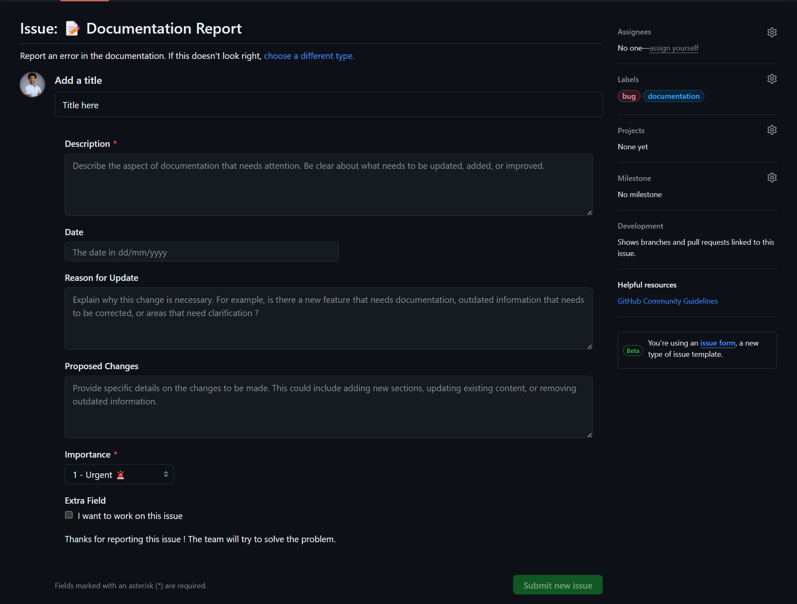

# Test Plan | Team 4
| Document Type  | Specification           |
| -------------- | ----------------------- |
| Document Owner | Habi CAILLEAU           |
| Issue date     | 10/04/2024              |
| Document Name  | Test Plan               |

 

## Test Plan approval
| Role               | Name                    | Signature | Date       |
| ------------------ | ----------------------- | --------- | ---------- |
| Project Manager    | Maxime CARON            |   ✅      | 04/10/2024 |
| Program Manager    | Lucas AUBARD            |   To fill   | To fill  |
| Technical Lead     | Alexis LASSELIN         |   To fill   | To fill  |
| Software Engineer  | Wilfried PORTET         |   To fill   | To fill  |
| Technical Writer   | Paul NOWAK              |   To fill   | To fill  |
| Quality Assurance  | Habi CAILLEAU           |   ✅        | To fill  |

 

---

 

 📖 Table of contents 

 

- [Test Plan | Team 4](#test-plan--team-4)
  - [Test Plan approval](#test-plan-approval)
  - [1.Introduction](#1introduction)
    - [I. Overview](#i-overview)
    - [II. Purpose](#ii-purpose)
    - [III. Scope](#iii-scope)
    - [VI. Test objectives](#vi-test-objectives)
  - [2.Test Environment](#2test-environment)
    - [I. Hardware Configuration](#i-hardware-configuration)
    - [II. Software Configuration](#ii-software-configuration)
    - [III. Tools and Utilities ( not finish )](#iii-tools-and-utilities--not-finish-)
  - [3.Test approach](#3test-approach)
    - [I. Test principles](#i-test-principles)
    - [II. Test levels](#ii-test-levels)
      - [Unit Testing](#unit-testing)
      - [Integration Testing](#integration-testing)
      - [System Testing](#system-testing)
      - [Acceptance Testing](#acceptance-testing)
    - [III. Test types](#iii-test-types)
      - [Function Testing](#function-testing)
      - [Unit Testing](#unit-testing-1)
      - [User Acceptance Testing (UAT)](#user-acceptance-testing-uat)
  - [4. Test Execution](#4-test-execution)
    - [I. Evaluation criteria](#i-evaluation-criteria)
    - [II. Testing phases](#ii-testing-phases)
    - [III. GitHub issue management](#iii-github-issue-management)
    - [VI. Test case Execution](#vi-test-case-execution)
    - [V. Validation and Bug report handling](#v-validation-and-bug-report-handling)
    - [VI. Bug tracking and report](#vi-bug-tracking-and-report)
    - [5. Testing outcomes](#5-testing-outcomes)
  - [8. Conclusion](#8-conclusion)
  - [9. Glossary](#9-glossary)

 
 

---

## 1.Introduction 

### I. Overview

The SportShield project aims to deliver a robust and user-friendly solution for securing sports equipment through innovative technology integration. As part of the project's development process, a comprehensive test plan has been devised to ensure the reliability, functionality, and security of the SportShield device.

The test plan encompasses a series of tests designed to validate key aspects of the solution, including battery life improvement, NFC functionality, simultaneous actions management, Bluetooth security, and alarm control enhancement. Each test is meticulously crafted to address specific user requirements and technical specifications outlined for the SportShield device.

### II. Purpose

The purpose of the SportShield test plan is to systematically validate and ensure the functionality, reliability, and security of the SportShield device. Through comprehensive testing procedures, the test plan aims to:

1. Verify Compliance: Confirm that the SportShield device meets all specified user requirements, technical specifications, and regulatory standards.

2. Identify Defects: Detect and address any defects, bugs, or inconsistencies in the functionality of the SportShield device to ensure a seamless user experience.

3. Validate Performance: Evaluate the performance of critical features such as battery life improvement, NFC functionality, simultaneous actions management, Bluetooth security, and alarm control enhancement to ensure optimal operation.

4. Mitigate Risks: Identify potential risks, vulnerabilities, or weaknesses in the SportShield device's design or implementation and implement mitigation strategies to minimize their impact.

5. Ensure User Satisfaction: Guarantee that the SportShield device delivers on its promise of providing enhanced security for sports equipment while offering intuitive functionality and ease of use for end-users.

### III. Scope
 

**In scope:**

- Comprehensive Testing: Thorough testing of each component of the SportShield device, including hardware and software components, to validate their functionality and performance.

- Functional Testing: Verification of all features and functionalities of the SportShield device to ensure they meet the specified requirements and operate as intended.

- System Behavior Validation: Identification and validation of expected system behavior under normal operating conditions, including response to user inputs and interaction with external systems.

- Scenario Testing: Testing of various scenarios and inputs to assess the robustness and resilience of the SportShield device, including stress testing and boundary testing.

- Integration Testing: Validation of interactions between different components and subsystems of the SportShield device to ensure seamless integration and interoperability.

 

**Out of scope:**

- Compatibility Testing: Testing the compatibility of the SportShield device with various hardware platforms, operating systems, or third-party software applications is not covered in this test plan. Compatibility testing, including interoperability testing, falls outside the scope of this document.

- Localization Testing: Validation of the SportShield device's functionality, user interface, or content across different languages, regions, or cultural settings is not addressed in this test plan. Localization testing, including translation verification and cultural adaptation testing, is excluded from the scope.

### VI. Test objectives

The test objectives for the SportShield project are to validate the functionality, reliability, and compatibility of the device, identify and document any defects or vulnerabilities, ensure optimal performance and security measures, and evaluate usability to enhance overall customer satisfaction. Through thorough testing, the aim is to confirm that the SportShield device meets its specified requirements, complies with industry standards, and delivers a seamless and user-friendly experience for end-users.

## 2.Test Environment

### I. Hardware Configuration

**Computer**

Lenovo Thinkbook 14 :
- Windows 11 Pro
- 14-inch (1920 x 1080)
- Processor: Intel(R) Core(TM) i7-1165G7 CPU @ 2.80GHz
- RAM: 16.0 GB
- System type: 64-bit operating system, x64-based processor*

 

**Embedded system**

- Development Board : 
Seeed XIAO BLE nRF52840

- Battery :
EEMB LP603449

- GPS Module :
CDtop Technology CD-PA1010D

- GSM Module :
SIMCom SIM800L

- NFC Module : 
Molex 146236

- Electromagnet 

- Piezoelectric Buzzer

### II. Software Configuration

**IDE** : arduino 2.3.2

**Library used** :
- NRF52_MBED_TimerInterrupt V1.4.1
- ArduinoBLE V1.3.6
- Adafruit GPS Library V1.7.4
- Sim800L http connector V1.14.0
- Seeed Arduino LSM6DS3 V2.0.3
- OneWire V2.3.7

### III. Tools and Utilities ( not finish )

- Digital multimeter 9V 
- oscillator 
- LightBlue 

## 3.Test approach

### I. Test principles 

The test approach for the SportShield project is guided by several key principles to ensure effectiveness and efficiency throughout the testing process. These principles include:

- The testing efforts will prioritize achieving project objectives and upholding quality standards, ensuring that the SportShield device meets or exceeds user expectations.

- While the testing processes will be well-established, they will also remain adaptable to accommodate changes as necessary, allowing us to respond effectively to evolving project requirements and challenges.

- Building upon the progress of previous stages, the testing activities will be strategically designed to avoid redundancy or unnecessary repetition, optimizing efficiency and resource utilization.

- We will organize testing into clearly delineated phases, each with specific objectives and milestones, facilitating a structured and systematic approach to quality assurance throughout the project lifecycle.

- As part of the quality assurance measures, we will conduct unit tests for every new feature introduced by the development team, ensuring that individual components work as intended before integration.

### II. Test levels

The SportShield project employs multiple test levels to validate the functionality, performance, and reliability of the device across different stages of development. These test levels include:

#### Unit Testing 
Testing individual components or modules of the SportShield device in isolation to ensure they function correctly and meet specified requirements.

#### Integration Testing 
Verifying the interaction and interoperability between different components or subsystems of the SportShield device to ensure seamless integration and proper communication.

#### System Testing 
Evaluating the integrated SportShield device as a whole to validate its overall functionality, performance, and compliance with user requirements and design specifications.

#### Acceptance Testing 
Conducting tests to validate that the SportShield device meets the acceptance criteria defined by CORIS Innovation and fulfills their business needs and expectations.

### III. Test types 

The test types employed in the SportShield project encompass various approaches to validate different aspects of the device's functionality and performance. These test types include:

#### Function Testing

Validating specific functionalities and features of the SportShield device to ensure they operate as intended and meet user requirements.

#### Unit Testing 
Testing individual units or components of the SportShield device, such as software modules or hardware components, to verify their correctness and functionality in isolation.

#### User Acceptance Testing (UAT)
 Involving end-users or representatives to evaluate the SportShield device in a real-world environment to ensure it meets their expectations and business needs.

## 4. Test Execution

### I. Evaluation criteria 
### II. Testing phases
### III. GitHub issue management

GitHub Issues are central to our issue management strategy, enabling efficient tracking and resolution of all identified issues, bugs, and enhancement requests during testing. Here's how we do it:

1. Issue Tracking: We use GitHub's robust system to meticulously document and monitor all issues, ensuring nothing slips through the cracks.

2. Issue Creation: Each problem is thoroughly documented in detailed GitHub issues, providing clear descriptions, reproducible steps, and relevant attachments for comprehensive context.

3. Prioritization: Issues are prioritized based on severity, impact, and business priorities, ensuring critical issues receive immediate attention to minimize project delays.

4. Assigning Ownership: Ownership of issues is assigned to appropriate team members, fostering accountability and streamlining resolution efforts.

5. Collaboration: GitHub issues facilitate collaboration among team members, enabling knowledge sharing and efficient problem-solving to maximize productivity.

6. Resolution and Closure: Timely resolution of issues is essential, with prompt closure after verification to maintain an accurate and up-to-date issue tracking system.

To facilitate the utulisation of GitHub issues I created a template :

### VI. Test case Execution
### V. Validation and Bug report handling
### VI. Bug tracking and report

### 5. Testing outcomes

|Name|Purpose|Link|
|-:|:-|:-:|
|Test Plan|Describes the strategy, breadth, goals, and assets allocated for testing.|[TEST PLAN]([../Testing/test_plan.md](https://github.com/algosup/2023-2024-project-4-SPORTSHIELD-team-4/blob/main/Documents/QA/TestPlan.md))|
|Test Cases|Ensure the software is working as intended, with all features and functionalities operating correctly.|[TO DO](nothing)|
|Bug Reports|Supply a detailed account of the problems to the development team, aiding in the prompt resolution of the issue|[REPORTS](https://github.com/algosup/2023-2024-project-4-SPORTSHIELD-team-4/issues)|

## 8. Conclusion

## 9. Glossary 