# Technical Specifications

---

## Table of Contents

<b>Click to expand</b>

- [Technical Specifications](#technical-specifications)
  - [Table of Contents](#table-of-contents)
  - [I. Introduction](#i-introduction)
    - [1. Overview](#1-overview)
    - [2. Context](#2-context)
    - [3. Goals and Objectives](#3-goals-and-objectives)
    - [4. Out of Scope](#4-out-of-scope)
    - [7. Future Goals](#7-future-goals)
    - [8. Assumptions](#8-assumptions)
  - [II. Hardware](#ii-hardware)
    - [1. Development Board](#1-development-board)
    - [2. Battery](#2-battery)
    - [3. GPS Module](#3-gps-module)
    - [4. GSM Module](#4-gsm-module)
    - [5. NFC Module](#5-nfc-module)
      - [Warning](#warning)
    - [6. Electromagnet](#6-electromagnet)
    - [7. Piezoelectric Buzzer](#7-piezoelectric-buzzer)
    - [8. Electronic Configuration](#8-electronic-configuration)
  - [III. Solutions](#iii-solutions)
    - [1. Current Product](#1-current-product)
      - [A. Pros](#a-pros)
      - [B. Cons](#b-cons)
    - [2. Proposed Solutions](#2-proposed-solutions)
      - [A. Battery Improvement](#a-battery-improvement)
        - [a. Battery Management](#a-battery-management)
        - [b. Battery Life Enhancement](#b-battery-life-enhancement)
      - [B. NFC Integration](#b-nfc-integration)
      - [C. Simultaneous Actions Handling](#c-simultaneous-actions-handling)
      - [D. Bluetooth Security Enhancement](#d-bluetooth-security-enhancement)
      - [E. Alarm Control Enhancement](#e-alarm-control-enhancement)
    - [3. Test Plan](#3-test-plan)
    - [4. Monitoring and Alerting Plan](#4-monitoring-and-alerting-plan)
    - [5. Rollout Plan](#5-rollout-plan)
    - [6. Rollback Plan](#6-rollback-plan)
    - [7. Alternative Solutions](#7-alternative-solutions)
  - [IV. Further Considerations](#iv-further-considerations)
    - [1. Constraints and Impact](#1-constraints-and-impact)
    - [2. Considerations](#2-considerations)
      - [A. Security Considerations](#a-security-considerations)
      - [B. Privacy Considerations](#b-privacy-considerations)
      - [C. Risks](#c-risks)
  - [V. Work](#v-work)
    - [1. Work Estimates and Timelines](#1-work-estimates-and-timelines)
    - [2. Prioritization](#2-prioritization)
    - [3. Milestones](#3-milestones)
    - [4. Future Work](#4-future-work)
  - [VI. Glossary](#vi-glossary)

---

## I. Introduction

### 1. Overview

CORIS Innovation, a French company, has tasked us with enhancing their product, SPORTSHIELD. SPORTSHIELD is a device used as a lock for sports equipment, integrated with a mobile application for locking and unlocking functionalities. The current solution faces several issues prompting the need for improvement.

### 2. Context

Challenges with the existing solution include limited device autonomy, lack of user notifications during alarm activation, and the inability to halt the alarm once activated.

### 3. Goals and Objectives

The primary objectives for the new solution are to:

- Maintain a minimum 7-day battery life with up to 6 hours of active use daily.
- Implement NFC functionality for device unlocking.
- Enable multi-action capability, including user notifications during alarm activation.
- Enhance security protocols for key system features such as lock/unlock and alarm management.

### 4. Out of Scope

The following is not within the scope of this project:

- Implementing LED blinking to indicate device functionality indication.
- Addressing security concerns related to charging, such as preventing firmware insertion during charging.
- Further enhancements to shock detection.

### 7. Future Goals

Certain requirements have been identified for future iterations:

- Securing the Bluetooth connection between the device and the mobile application.
- Enhancing alarm management to allow users to halt the alarm once the ringing cycle commences.

### 8. Assumptions

We are operating under the following assumptions:

- All essential hardware and software components required for development and testing will be readily available.
- Access to the current solution will be granted to facilitate understanding of its functionality and encountered issues.
- The company will provide us with the requisite documentation and assistance to comprehend the current solution and its associated challenges.

## II. Hardware

### 1. Development Board

- **Description:** The Seeed XIAO BLE nRF52840 is an ultra-compact, ultra-low-power Bluetooth development board. It features the Nordic Semiconductor nRF52840 system-on-chip (SoC) which supports Bluetooth 5.0, Bluetooth Low Energy (BLE), and various other wireless protocols. The board is designed for IoT applications and provides ample computing power and connectivity options in a small form factor.
- **Brand:** Seeed Studio

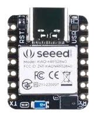

### 2. Battery

- **Description:** The EEMB LP603449 is a lithium-ion polymer rechargeable battery. It is designed for portable electronic devices and offers high energy density, lightweight construction, and long cycle life. The LP603449 has a specific capacity of 1100mAh and provides reliable power for extended periods
- **Brand:** EEMB

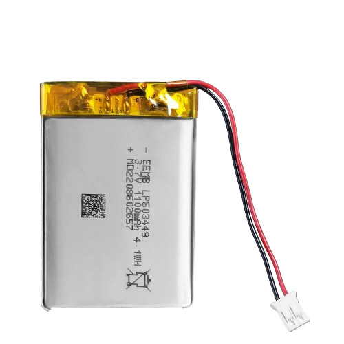

### 3. GPS Module

- **Description:** The CDtop Technology CD-PA1010D is a GPS module utilizing the MediaTek GNSS Chipset MT3333. It offers high-accuracy positioning and supports multiple satellite navigation systems including GPS, GLONASS, and BeiDou. The module is compact and suitable for various tracking and navigation applications.
- **Brand:** CDtop Technology

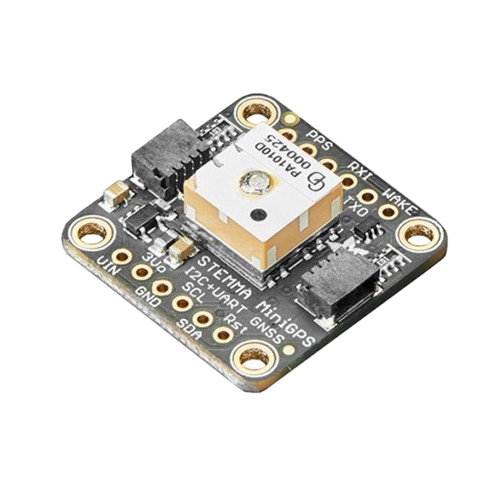

### 4. GSM Module

- **Description:** The SIMCom SIM800L is a miniature cellular module enabling GPRS transmission. It provides GSM/GPRS communication capabilities in a small form, making it suitable for IoT and M2M applications requiring cellular connectivity. The SIM800L supports quad-band GSM/GPRS operation and offers features such as SMS and GPRS data transmission.
- **Brand:** SIMCom

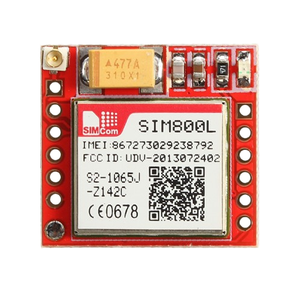

### 5. NFC Module

- **Description:** The Molex 146236 is an NFC and RFID antenna module. It enables near-field communication (NFC) and RFID tag reading/writing functionality. The module is compact and provides reliable performance for applications such as contactless payment, access control, and inventory tracking.
- **Brand:** Molex

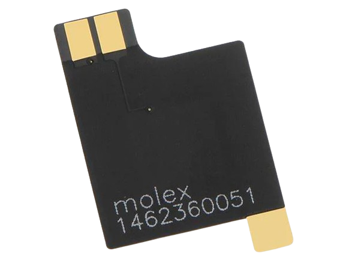

#### Warning

There is no library existing for the development board that we are using. That's why, until the release of the library, we won't be able to implement the NFC functionality.

### 6. Electromagnet

- **Description:** The electromagnet has specifications of 12V and 500mA. It is designed to generate a magnetic field when current flows through it. It is compact and suitable for various applications requiring magnetic attraction or control.
- **Dimensions:** 2.7 x 1.6 x 1.3 cm

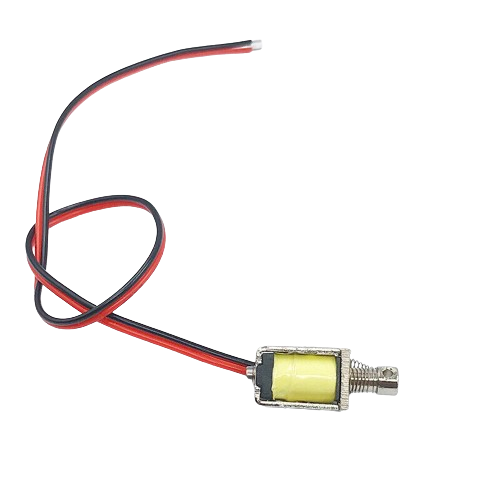

### 7. Piezoelectric Buzzer

- **Description:** The piezoelectric buzzer operates at 12V and produces a sound intensity of approximately 90-100 dB. It is commonly used for audible alerts and notifications in electronic devices. The buzzer generates sound through the piezoelectric effect and is compact and lightweight.
- **Operating Voltage:** 12V
- **Sound Intensity:** Approximately 90-100 dB

### 8. Electronic Configuration

This is what the electronic configuration of the device looks like:

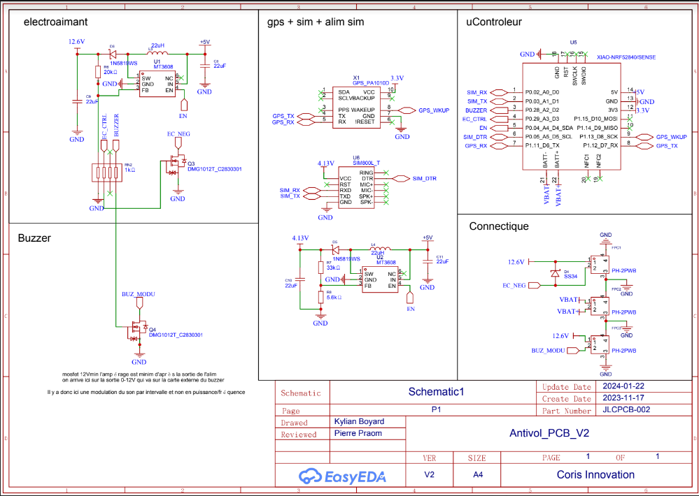

## III. Solutions

### 1. Current Product

The current solution is still in its development phase and encompasses the following features:

- The device functions as a lock for different sports equipment.
- It is paired with a mobile application that enables users to lock and unlock the equipment remotely.
- The device has a typical battery life of 3 days under optimal conditions.
- Bluetooth connectivity facilitates communication between the device and the mobile application.
- An alarm is triggered upon detecting a shock, emitting 3 light sounds for minor shocks and 5 long high sounds for significant shocks.
- Locking and unlocking of the device can be performed via the mobile application.
- The mobile application provides geo-location functionality for tracking the device's location.

#### A. Pros

- Provides remote locking and unlocking capabilities, improving convenience for users.
- Offers shock detection functionality to alert users of potential tampering or unauthorized access.
- Incorporates geo-location features to assist users in tracking misplaced or stolen equipment.

#### B. Cons

- Limited battery life may necessitate frequent recharging, potentially leading to user inconvenience.
- Reliance on Bluetooth connectivity may result in connectivity issues or limitations in range.
- The alarm system's simplicity may not adequately address all potential security concerns or user preferences.

### 2. Proposed Solutions

#### A. Battery Improvement

To address the challenge of limited battery life, we propose the following improvements:

**Objective**: Extend the device's battery life to 7 days with up to 6 hours of active use per day by optimizing power consumption and implementing efficient battery management techniques.

- **Acceptance criteria**:
  - Device battery life will be extended to 7 days for normal use, allowing up to 6 hours of active use per day.
  - Charging will be limited to 80% of battery capacity to improve longevity.

##### a. Battery Management

- **Implementation Strategy**:
  One of the most energy-consuming parts of the device is the GPS module. Instead of sending the GPS data every 5 minutes, it is only sent if the device feels a shock.
  This will save a lot of battery power.

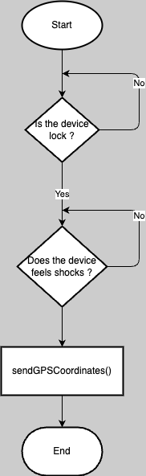

If we wanted to save even more battery, once we're in low battery mode, we could stop the GPS module but it would mean that the device would not be able to send its location to the mobile application.

Another solution is to automatically stop the Bluetooth module if the user has not been interacting with the device for 5 minutes or if they are not in range of the device.

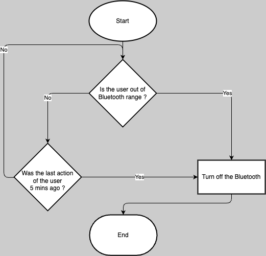

##### b. Battery Life Enhancement

- **Implementation Strategy**:
  - Employ efficient battery management algorithms to regulate power usage effectively.
  - Implement a charging limit of 80% of the battery's capacity to prolong its lifespan.

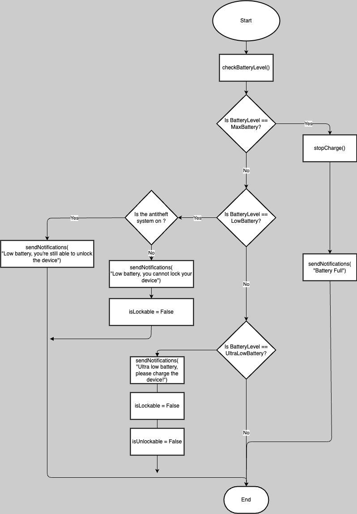

#### B. NFC Integration

To expand the device's functionality, we propose integrating NFC capabilities to facilitate device locking and unlocking:

**Objective**: Incorporate NFC functionality to enable users to lock/unlock the device using their mobile phones.

- **Implementation Approach**:

  - Utilize a library compatible with the device's development board to enable NFC functionality. This will allow the device to communicate with the mobile application using NFC.
    Unfortunately, we don't have the library that we will use to implement the NFC functionality. That's why, if we don't find any other solution, we will try to develop the library ourselves.

- **Acceptance Criteria**:
  - The device will support locking/unlocking via the mobile application using NFC functionality.
  - NFC functionality will be validated using a smartphone's NFC tag for testing purposes.

#### C. Simultaneous Actions Handling

**Objective**: Develop a system for managing simultaneous actions, with a specific focus on notifying the user when the alarm is triggered.

- **Implementation Strategy**:

  - Instead of doing the actions in parallel, we will do them in series, allowing us to save a lot of battery and to avoid the device being overwhelmed by the actions.

  Here is the flow of the actions:

  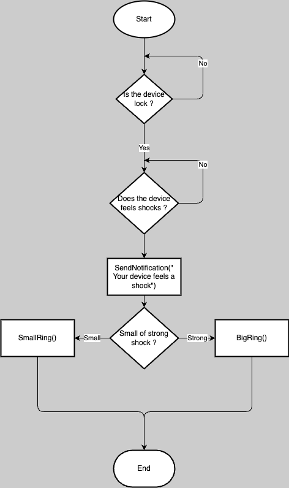

- **Acceptance Criteria**:
  - The system effectively identifies and manages simultaneous actions, especially the activation of the alarm.
  - Users receive timely notifications on their mobile devices when the alarm is triggered.
  - The notification system operates efficiently, delivering real-time alerts without delays.

#### D. Bluetooth Security Enhancement

**Objective**: Strengthen the security protocols governing Bluetooth connectivity between the device and the mobile application.

- **Implementation Approach**:

  - Implement robust encryption protocols to secure data transmission over Bluetooth.
  - Utilize secure pairing mechanisms to establish a trusted connection between the device and the mobile application.
  - Integrate authentication measures to validate the identities of the device and the mobile application during pairing.

- **Acceptance Criteria**:

  - Data transmitted over Bluetooth will be encrypted to ensure confidentiality and integrity.
  - Secure pairing mechanisms will prevent unauthorized devices from connecting to the SPORTSHIELD device.
  - Authentication measures will successfully validate the identities of the device and the mobile application, mitigating the risk of unauthorized access.

  Unfortunately, we don't have the actual implementation of Bluetooth security, so we cannot provide a flow for this feature.

#### E. Alarm Control Enhancement

**Objective**: Improve the alarm management system to enable users to stop the alarm once the ringing cycle begins.

- **Implementation Strategy**:

  - Develop a mechanism allowing users to halt the alarm once activated, for instance, if the device is accidentally moved and triggers the alarm. There will be two methods to stop the alarm:
    - The first method involves stopping the alarm using the mobile application via Bluetooth, enabling users to stop the alarm remotely.
    - The second method involves stopping the alarm using NFC functionality, providing users with an alternative method to stop the alarm without relying on the mobile application.

  Refer to the flowchart below for the alarm management process:

  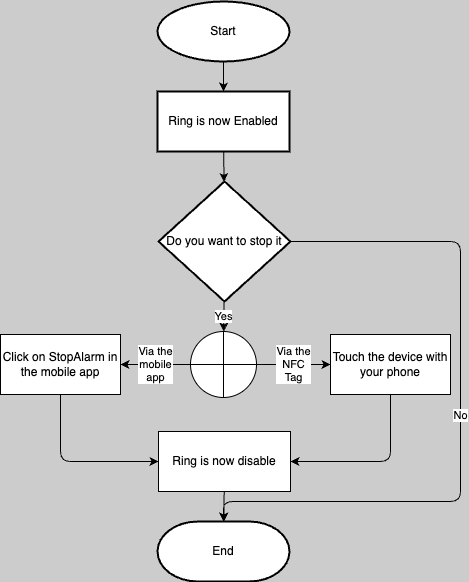

- **Acceptance Criteria**:
  - Users can stop the alarm once the ringing cycle starts, either with the mobile application or the device itself.

### 3. Test Plan

The following tests will be conducted to ensure that the new solution meets the user requirements:

- **Battery Life Improvement & Low Level Management**:

  - Unit tests will be conducted to verify the effectiveness of power consumption optimization and battery management algorithms.
  - Integration tests will be performed to assess the device's battery life under various usage scenarios.
  - Quality assurance (QA) testing will be carried out to validate the device's battery life and charging management.

- **NFC Functionality**:

  - Unit tests will be conducted to evaluate the implementation of NFC functionality for device locking and unlocking.
  - Integration tests will be performed to ensure seamless integration between the device and the mobile application for NFC-based locking/unlocking.
  - QA testing will be carried out to validate the device's NFC functionality and its compatibility with the mobile application.

- **Simultaneous Actions Management**:

  - Unit tests will be conducted to verify the system's ability to detect and manage simultaneous actions, particularly the activation of the alarm.
  - Integration tests will be performed to assess the notification system's performance and real-time alert delivery.
  - QA testing will be carried out to validate the system's ability to manage simultaneous actions and deliver timely notifications to users.

- **Bluetooth Security**:
  - Unit tests will be conducted to evaluate the implementation of encryption protocols, secure pairing mechanisms, and authentication measures for Bluetooth security.
  - Integration tests will be performed to assess the security of data transmission and the establishment of trusted connections between the device and the mobile application.
  - QA testing will be carried out to validate the effectiveness of Bluetooth security measures and their ability to prevent unauthorized access.
- **Alarm Control Enhancement**:
  - Unit tests will be conducted to verify the implementation of the alarm management system, including the ability to stop the alarm once the ringing cycle begins.
  - Integration tests will be performed to assess the user's ability to stop the alarm using the Bluetooth and NFC functionality.
  - QA testing will be carried out to validate the effectiveness of the alarm control enhancement and the user's ability to halt the alarm.

### 4. Monitoring and Alerting Plan

The following monitoring and alerting plan will be implemented to ensure the health and observability of the new solution:

- **Metrics for Health Measurement**:

  - Battery life: Monitoring the device's battery life and charging status to ensure optimal performance.
  - NFC functionality: Observing the usage and performance of NFC functionality for device locking and unlocking.
  - Simultaneous actions management: Tracking the system's ability to detect and manage simultaneous actions, particularly the activation of the alarm.
  - Bluetooth security: Monitoring the security of data transmission and the establishment of trusted connections between the device and the mobile application.

- **Alert Plan**:

  - Battery life: Alerts will be triggered when the device's battery life falls below a predefined threshold, indicating the need for recharging.
  - NFC functionality: Alerts will be generated in case of NFC functionality issues, such as failure to lock/unlock the device using NFC.
  - Simultaneous actions management: Alerts will be raised if the system fails to detect and manage simultaneous actions, particularly the activation of the alarm.
  - Bluetooth security: Alerts will be triggered in the event of security breaches or unauthorized access attempts over Bluetooth.

### 5. Rollout Plan

- **Deployment Architecture**:

  - The new solution will be deployed using a phased roll-out approach, allowing for gradual implementation and testing of each feature.
  - Deployment environments will include development, testing, staging, and production environments to facilitate thorough testing and validation.

- **Phased Roll-out Plan**:
- **Phase 1**:
  - Battery life improvement & low-level management: Implement power consumption optimization and battery management algorithms.
  - NFC functionality: Integrate NFC functionality for device locking and unlocking.
- **Phase 2**:
  - Simultaneous actions management: Develop a system for managing simultaneous actions, particularly the activation of the alarm.
  - Bluetooth security: Enhance the security protocols governing Bluetooth connectivity between the device and the mobile application.

Each phase will involve thorough testing and validation before proceeding to the next phase.

To communicate with the client about the different phases, we will use the resume summary of each feature. This will allow the client to understand the progress of the project and to give feedback on the different features.

### 6. Rollback Plan

<!--
Detailed and specific liabilities
Plan to reduce liabilities
Plan to describe how to prevent other components, services, and systems from being affected
-->

In the event of any issues or failures during the roll-out of the new solution, the following rollback plan will be implemented:

- **Liabilities**:

  - Battery life improvement & low-level management: Potential issues may arise with power consumption optimization and battery management algorithms, leading to reduced battery life or charging problems.
  - NFC functionality: Failures in the implementation of NFC functionality may result in issues with device locking/unlocking using NFC.
  - Simultaneous actions management: System failures may occur in detecting and managing simultaneous actions, particularly the activation of the alarm.
  - Bluetooth security: Security breaches or unauthorized access attempts over Bluetooth may pose significant liabilities.

- **Liability Reduction Plan**:

  - Battery life improvement & low-level management: Thorough testing and validation will be conducted to identify and address any issues related to power consumption optimization and battery management algorithms. Additionally, response time for addressing such issues will be minimized to ensure uninterrupted user experience.
  - NFC functionality: Extensive testing will be carried out to ensure the seamless integration of NFC functionality for device locking and unlocking. Furthermore, ease of use will be a priority in NFC feature implementation.
  - Simultaneous actions management: Rigorous testing and validation will be performed to verify the system's ability to detect and manage simultaneous actions, particularly the activation of the alarm. Moreover, real-time monitoring will be implemented to swiftly respond to any anomalies in simultaneous action management.
  - Bluetooth security: Comprehensive testing and validation will be conducted to identify and address any security breaches or unauthorized access attempts over Bluetooth. Additionally, encryption protocols will be regularly updated to mitigate potential security risks.

### 7. Alternative Solutions

<!--
Summary statement for each alternative solution
Pros and cons for each alternative
Reasons why each solution couldn’t work
Ways in which alternatives were inferior to the proposed solution
Migration plan to next best alternative in case the proposed solution falls through
-->

The following alternative solutions were considered but ultimately deemed inferior to the proposed solution:

- **Alternative Solution 1**:

  - **Summary**: Implement a more powerful battery to extend the device's battery life.
  - **Pros**: Potential for significantly extended battery life.
  - **Cons**: Increased cost and complexity, the potential impact on device size and weight.
  - **Reasons**: The proposed solution offers a more cost-effective and efficient approach to extending battery life without significant changes to the device's hardware.
  - **Migration Plan**: If the proposed solution falls through, the next best alternative would be to explore more powerful battery options and their impact on the device's design and performance.

- **Alternative Solution 2.1**:

  - **Summary**: Develop a separate device for NFC functionality, eliminating the need to integrate it into the SPORTSHIELD device.
  - **Pros**: Simplified device design and development, potential for reduced cost and complexity.
  - **Cons**: Additional hardware and maintenance requirements, potential impact on user experience and convenience.
  - **Reasons**: The proposed solution offers a more integrated and user-friendly approach to incorporating NFC functionality into the SPORTSHIELD device, enhancing its capabilities and convenience for users.
  - **Migration Plan**: If the proposed solution falls through, the next best alternative would be to explore the development of a separate device for NFC functionality and its integration with the SPORTSHIELD device.

- **Alternative Solution 2.2**:

  - **Summary**: Develop our own NFC library to implement the NFC functionality.
  - **Pros**: Full control over the NFC functionality, potential for enhanced user experience and convenience.
  - **Cons**: Increased complexity and development time, potential for compatibility issues and maintenance requirements.
  - **Reasons**: The current library is not done yet and we don't know when it will be released. That's why, if we don't find any other solution, we will try to develop the library ourselves.
  - **Migration Plan**: If the proposed solution falls through, the next best alternative would be to explore the development of our own NFC library and its impact on the device's functionality and user experience.

- **Alternative Solution 3**:

  - **Summary**: Focus on enhancing the device's shock detection capabilities to address security concerns.
  - **Pros**: Improved security and tamper detection, potential for enhanced user confidence.
  - **Cons**: Limited impact on battery life and user convenience, potential for increased complexity and cost.
  - **Reasons**: The proposed solution offers a more comprehensive and user-centric approach to addressing multiple user requirements, including battery life improvement, NFC functionality, and simultaneous actions management.
  - **Migration Plan**: If the proposed solution falls through, the next best alternative would be to explore the enhancement of the device's shock detection capabilities and their impact on security and user experience.

- **Alternative Solution 4**:
  - **Summary**: Focus on enhancing the device's Bluetooth connectivity and security features.
  - **Pros**: Improved data transmission security, potential for enhanced user privacy and protection.
  - **Cons**: Limited impact on battery life and user convenience, potential for increased complexity and cost.
  - **Reasons**: The proposed solution offers a more comprehensive and user-centric approach to addressing multiple user requirements, including battery life improvement, NFC functionality, and simultaneous actions management.
  - **Migration Plan**: If the proposed solution falls through, the next best alternative would be to explore the enhancement of the device's Bluetooth connectivity and security features and their impact on data transmission and user privacy.

## IV. Further Considerations

### 1. Constraints and Impact

<!--
How will this increase the work of other people?
-->

The first problem that we will encounter is that there is no NFC library existing for the development board that we are using. It means that we cannot implement the NFC functionality without the development of this library. That's why, if we don't find any other solution, we will try to develop the library ourselves but it will increase the workload of our project.

Because we're adding a lot of features to the device such as the alarm management or the NFC functionality, the team that is in charge of the mobile application will have to update the application to support these new features. This will increase their workload. They will be most impacted by the changes we are making.

We also planned to create an operator manual to help the software team understand how our work would impact them. This will allow them to anticipate the changes and to prepare for the changes.

You can find the operator manual in the [Operator Manual](../OperatorManual/OperatorManual.md) document.

### 2. Considerations

#### A. Security Considerations

<!--
What are the potential threats?
How will they be mitigated?
How will the solution affect the security of other components, services, and systems?
-->

There are two main threats that we will have to mitigate:

- **Unauthorized Access**: The device is connected to the mobile application via Bluetooth. This means that if the Bluetooth connection is not secure, an attacker could connect to the device and unlock it. We will have to make sure that the Bluetooth connection is secure enough to prevent this from happening.
  The device may also be "infected" with a virus if the device is connected to a computer via the charging cable but we will not address this issue in this project.
- **Stolen Device**: If the device is stolen, the thief could unlock it and steal the equipment. We will have to make sure that the device is secure enough to stop this happening.

#### B. Privacy Considerations

<!--
Does the solution follow local laws and legal policies on data privacy?
How does the solution protect users’ data privacy?
What are some of the tradeoffs between personalization and privacy in the solution?
-->

Because we are only working on the device and not on how the data is handled, we don't have to worry about the privacy of the users' data. The company is in charge of the data and how it is handled. However, there is still a risk that the data could be compromised if the device is stolen.

#### C. Risks

<!--
What risks are being undertaken with this solution?
Are there risks that once taken can’t be walked back?
What is the cost-benefit analysis of taking these risks?
-->

The main risk we are taking is that we are adding a lot of features to the device. This could lead to the device being more complex and therefore more prone to bugs. We will have to make sure that we test the device thoroughly to prevent this from happening.

There are a lot of risks that we will describe in the table below:

| Risk                                                                   | Impact                                                                                                          |
| ---------------------------------------------------------------------- | --------------------------------------------------------------------------------------------------------------- |
| The device is locked and there is an issue with the battery thresholds | The user will not be able to unlock the device and will have to wait for the charge of the device to unlock it. |
| The device is stolen while the alarm is deactivated                    | The user will not be notified and will not be able to track the device.                                         |
| The device's components are broken                                     | The device will not work properly and the user will not be able to use it.                                      |
| The battery is not charging properly                                   | The device will not respect the battery life and will not fulfil the client's requirements.                     |
| The device is not able to connect to the mobile application            | The user will not be able to lock or unlock the device.                                                         |

## V. Work

### 1. Work Estimates and Timelines

| Task                                        | Resources Needed                  | Time Estimate   |
| ------------------------------------------- | --------------------------------- | --------------- |
| Solution A.1: Battery Life Improvement      | The complete hardware             | 2 weeks         |
| Solution A.2: Battery Low Level Management  | The complete hardware             | 1 week          |
| Solution B: NFC Functionality               | The complete hardware + NFC Tools | 2 week and half |
| Solution C: Simultaneous Actions Management | The complete hardware             | 1 week and half |

All the tasks will be done in parallel to reduce the time of the project.

### 2. Prioritization

<!--
Categorization of tasks by urgency and impact
-->

As written in the MoSCoW method, we will prioritize the tasks as follows:

- **Must Have**:
  - Solution A.1: Battery Life Improvement
  - Solution B: NFC Functionality
- **Should Have**:
  - Solution A.2: Battery Low-Level Management
  - Solution C: Simultaneous Actions Management
- **Could Have**:
  - Solution D: Bluetooth Security
  - Solution E: Alarm Management
- **Won't Have**:
  - Blinking LED to indicate device status
  - Security concerns related to charging
  - Further enhancements to shock detection

### 3. Milestones

<!--
Dated checkpoints when significant chunks of work will have been completed
Metrics to indicate the passing of the milestone
-->

The following milestones will be established to track the progress of the project:

- **Milestone 1**:

  - Completion of Solution A.1: Battery Life Improvement
    - Metrics: The device's battery life is extended to 7 days under normal usage conditions, allowing for up to 6 hours of active use per day. Additionally, response time and ease of use are optimized for enhanced user experience.

- **Milestone 2**:

  - Completion of Solution B: NFC Functionality
    - Metrics: The device supports locking/unlocking via the mobile application using NFC functionality.

- **Milestone 3**:

  - Completion of Solution A.2: Battery Low-Level Management
    - Metrics: Charging is restricted to 80% of the battery's capacity to enhance longevity. Furthermore, response time for battery level warnings and management is improved, ensuring ease of use.

- **Milestone 4**:

  - Completion of Solution C: Simultaneous Actions Management
    - Metrics: The system effectively identifies and manages simultaneous actions, especially the activation of the alarm.

- **Milestone 5**:

  - Completion of Solution E: Alarm Management
    - Metrics: Users can stop the alarm once the ringing cycle starts, either through the mobile application or the device itself.

- **Milestone 6**:
  - Completion of Solution D: Bluetooth Security
    - Metrics: Data transmitted over Bluetooth encrypted to ensure confidentiality and integrity.

### 4. Future Work

<!--
List of tasks that will be completed in the future
-->

The following tasks have been identified for future iterations:

- **Working LED Blinking**: Implement LED blinking to indicate device functionality.
- **Charging Security**: Address security concerns related to charging, such as blocking the insertion of code into the device's firmware during charging.
- **Shock Detection Enhancement**: Further enhancements to shock detection to improve security and tamper detection.

## VI. Glossary

<!--
New terms you come across as you research your design or terms you may suspect your readers/stakeholders not to know.
-->

| Term | Definition                                                                                                                                                                                                                               | Source                                                                                               |
| ---- | ---------------------------------------------------------------------------------------------------------------------------------------------------------------------------------------------------------------------------------------- | ---------------------------------------------------------------------------------------------------- |
| BLE  | BLE, or Bluetooth Low Energy, is a wireless personal area network technology designed and marketed by the Bluetooth Special Interest Group. It is used for short-range communication between devices.                                    | [Wikipedia](https://en.wikipedia.org/wiki/Bluetooth_Low_Energy)                                      |
| GPS  | GPS, or Global Positioning System, is a satellite-based navigation system that allows users to determine their approximate location (latitude, longitude, and altitude) anywhere on Earth.                                               | [Wikipedia](https://fr.wikipedia.org/wiki/Global_Positioning_System)                                 |
| GSM  | GSM (Global System for Mobile Communication) is a digital mobile network that is widely used by mobile phone users in Europe and other parts of the world.                                                                               | [Techopedia](https://www.techopedia.com/definition/5062/global-system-for-mobile-communications-gsm) |
| LED  | A light-emitting diode (LED) is a semiconductor light source that emits light when current flows through it. LEDs are used in a variety of applications, including displays, lighting, and automotive lighting.                          | [Wikipedia](https://en.wikipedia.org/wiki/Light-emitting_diode)                                      |
| NFC  | NFC, or near-field communication, is a short-range wireless technology that allows your phone to act as a transit pass or credit card, quickly transfer data, or instantly pair with Bluetooth devices like headphones and speakers.     | [Wikipedia](https://en.wikipedia.org/wiki/Near-field_communication)                                  |
| RFID | RFID, or radio-frequency identification, uses electromagnetic fields to automatically identify and track tags attached to objects. The tags contain electronically stored information. RFID tags are used in many industries.            | [Wikipedia](https://en.wikipedia.org/wiki/Radio-frequency_identification)                            |
| SoC  | A system-on-a-chip (SoC) is an integrated circuit that integrates all or most components of a computer or other electronic system into a single chip. SoCs are used in a variety of applications, including smartphones and IoT devices. | [Wikipedia](https://en.wikipedia.org/wiki/System_on_a_chip)                                          |
