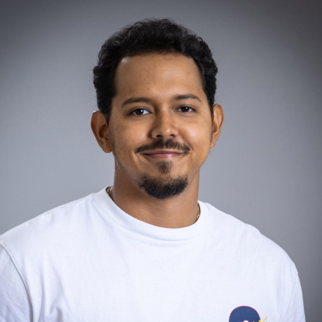

# SPORTSHIELD Team 4

**SPORTSHIELD** is an original anti-theft system for sports equipment. It's a project contracted by the company [Coris Innovation](https://www.corisinnovation.com/).

This device is designed to protect sports equipment such as skis and snowboards. It is composed of a **GPS** and a **GSM** module. The **GPS** module is used to locate the equipment, and the **GSM** module is used to send the location to the user's smartphone. The device is also equipped with a **gyroscope** to detect any movement of the equipment. The user can then be alerted in case of theft. The device is powered by a **battery** and can be recharged via a **USB-C** port. It's also equipped with an **NFC** module to unlock or lock the device. Finally, a **buzzer** is used to alert the user in case of theft.

For this project, Coris Innovation has asked us to:

- Increase the lifespan of the **battery**.🔋
- Add the possibility to use **NFC** to unlock or lock the device.🔓
- Implement a way to manage simultaneous actions on the device.🔄

## Technologies used

- **Arduino** for the development of the hardware.  (And to develop it we use  and  )

## Documentation

Here is the list of all the main documents related to the project:

- [Management Artifacts](Documents/Management/ManagementArtifacts.md)
- [Functional Specification](Documents/FunctionalSpecifications/FunctionalSpecifications.md)
- [Technical Specification](Documents/TechnicalSpecification/TechnicalSpecifications.md)
- [User Manual](Documents/UserManual/UserManual.md) Note: The user manual is not yet available.
- [Test Plan](Documents/QA/TestPlan.md)

## How to Use

### Prerequisites

Before getting started, ensure you have the following:

- **Arduino IDE**: Install it on your computer. You can download it [here](https://www.arduino.cc/en/software).
- **LightBlue** Application: Install it on your smartphone. You can download it for [Android](https://play.google.com/store/apps/details?id=com.punchthrough.lightblueexplorer&hl=fr&gl=US) and [iOS](https://apps.apple.com/fr/app/lightblue/id557428110).
- **Arduino** Board: Make sure you have one available.

### Installation

Follow these steps to set up:

1. **Clone the Repository**:
    ```bash
    git clone https://github.com/algosup/2023-2024-project-4-SPORTSHIELD-team-4.git
    ```

2. **Open Arduino IDE**:
    Open the Arduino IDE and navigate to the SPORTSHIELD.ino file located in the Code folder here: `2023-2024-project-4-SPORTSHIELD-team-4/Code/SPORTSHIELD/SPORTSHIELD.ino`

3. **Connect Arduino Board**:
    Connect your Arduino board to your computer.

4. **Configure Arduino IDE**:
    Select the correct board and port in the Arduino IDE.

5. **Upload Code**:
    Upload the code to your Arduino board.

6. **Open LightBlue Application**:
    Launch the LightBlue application on your smartphone.

7. **Connect to SPORTSHIELD Device**:
    Find and connect to the SPORTSHIELD device. It should appear in the list of devices in the LightBlue application with the name "Team 4".

8. **Start Using SPORTSHIELD**:
    Now you can start using the SPORTSHIELD device. Enjoy!

## Contributors
| Photo                                                                                                                                     | Name            | Role              | LinkedIn                                                           |
| ----------------------------------------------------------------------------------------------------------------------------------------- | --------------- | ----------------- | ------------------------------------------------------------------ |
| [](https://github.com/MaximeAlgosup)    | Maxime CARON    | Project Manager   | [LinkedIn](https://www.linkedin.com/in/maxime-caron-dev/)          |
| [](https://github.com/LucasAub)          | Lucas AUBARD    | Program Manager   | [LinkedIn](https://www.linkedin.com/in/lucas-aubard-596b37251/)    |
| [](https://github.com/AlexisLasselin) | Alexis LASSELIN | Technical Leader  | [LinkedIn](https://www.linkedin.com/in/alexis-lasselin-318649251/) |
| [](https://github.com/PortetWilfried) | Wilfried PORTET | Software Engineer | [LinkedIn](https://www.linkedin.com/in/wilfried-portet-a882b9293/) |
| [](https://github.com/PaulNowak36)        | Paul NOWAK      | Technical Writer  | [LinkedIn](https://www.linkedin.com/in/paul-nowak-0757a61a7/)      |
| [](https://github.com/habicll)          | Habi CAILLEAU   | Quality Assurance | [LinkedIn](https://www.linkedin.com/in/habi-cailleau-3b72b5293/)   |
