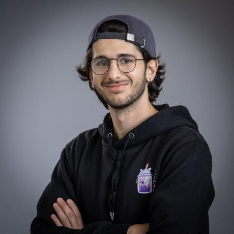

# SPORTSHIELD Team 4

## Team Members

| Photo                                                                                                   |      Name       |       Role        | LinkedIn                                                           |
| ------------------------------------------------------------------------------------------------------- | :-------------: | :---------------: | ------------------------------------------------------------------ |
|  |  Maxime CARON   |  Project Manager  | [LinkedIn](https://www.linkedin.com/in/maxime-caron-dev/)          |
|                           |  Lucas AUBARD   |  Program Manager  | [LinkedIn](https://www.linkedin.com/in/lucas-aubard-596b37251/)    |
|                  | Alexis LASSELIN | Technical Leader  | [LinkedIn](https://www.linkedin.com/in/alexis-lasselin-318649251/) |
|                  | Wilfried PORTET | Software Engineer | [LinkedIn](https://www.linkedin.com/in/wilfried-portet-a882b9293/) |
|                                 |   Paul NOWAK    | Technical Writer  | [LinkedIn](https://www.linkedin.com/in/paul-nowak-0757a61a7/)      |
|                        |  Habi CAILLEAU  | Quality Assurance | [LinkedIn](https://www.linkedin.com/in/habi-cailleau-3b72b5293/)   |
