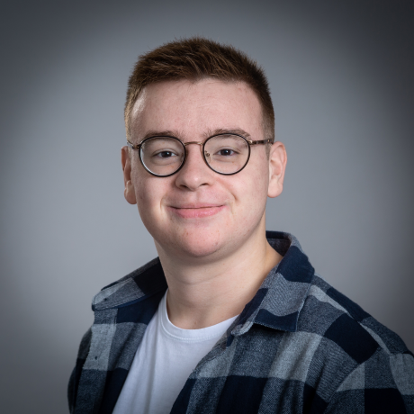
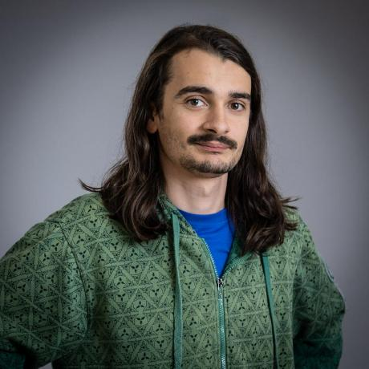

# SPORTSHIELD Team 4

**SPORTSHIELD** is an original anti-theft system for sports equipment. It's a project contracted by the company [Coris Innovation](https://www.corisinnovation.com/).

This device is designed to protect sports equipment such as skis and snowboards. It is composed of a **GPS** and a **GSM** module. The **GPS** module is used to locate the equipment, and the **GSM** module is used to send the location to the user's smartphone. The device is also equipped with a **gyroscope** to detect any movement of the equipment. The user can then be alerted in case of theft. The device is powered by a **battery** and can be recharged via a **USB-C** port. It's also equipped with an **NFC** module to unlock or lock the device. Finally, a **buzzer** is used to alert the user in case of theft.

For this project, Coris Innovation has asked us to:

- Increase the lifespan of the **battery**.🔋
- Add the possibility to use **NFC** to unlock or lock the device.🔓
- Implement a way to manage simultaneous actions on the device.🔄

## Technologies used

- **Arduino** for the development of the hardware.  (For the code  and  )

## Documentation

Here is the list of all the main documents related to the project:

- [Management Artifacts](Documents/Management/ManagementArtifacts.md)
- [Functional Specification](Documents/FunctionalSpecifications/FunctionalSpecifications.md)
- [Technical Specification](Documents/TechnicalSpecification/TechnicalSpecifications.md)
- [User Manual](Documents/UserManual/UserManual.md) Note: The user manual is not yet available.
- [Test Plan](Documents/QA/TestPlan.md)

## Contributors

| Photo | Name | Role | LinkedIn |
| --- | --- | --- | --- |
|  | Maxime CARON | Project Manager | [LinkedIn](https://www.linkedin.com/in/maxime-caron-dev/) |
|  | Lucas AUBARD | Program Manager | [LinkedIn](https://www.linkedin.com/in/lucas-aubard-596b37251/) |
|  | Alexis LASSELIN | Technical Leader | [LinkedIn](https://www.linkedin.com/in/alexis-lasselin-318649251/) |
|  | Wilfried PORTET | Software Engineer | [LinkedIn](https://www.linkedin.com/in/wilfried-portet-a882b9293/) |
|  | Paul NOWAK | Technical Writer | [LinkedIn](https://www.linkedin.com/in/paul-nowak-0757a61a7/) |
|  | Habi CAILLEAU | Quality Assurance | [LinkedIn](https://www.linkedin.com/in/habi-cailleau-3b72b5293/) |
