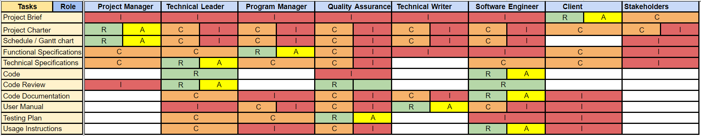

# Project Charter - SPORTSHIELD [Team 4]
## Document Control

**Document Information:**

|                   | Information |
| ----------------- | ----------- |
| Document Owner    | Maxime CARON|
| Creation Date     | 2024/03/10  |
| Last Update Date  | 2024/03/14  |
| Document Name     | Project Charter - SPORTSHIELD [Team 4]|

---
**Document Approvals:**

| Role               | Name  | Date  |
| ------------------ | ----- | ----- |
| Project Manager    | Maxime CARON | 2024/03/14 |
| Technical Leader   |       |       |
| Program Manager    |       |       |
| Quality Assurance  |       |       |
| Technical Writer   |       |       |
| Software Engineer  |       |       |

---

Click to expand!

- [Project Charter - SPORTSHIELD \[Team 4\]](#project-charter---sportshield-team-4)
  - [Document Control](#document-control)
  - [Project Overview](#project-overview)
  - [Project Goals](#project-goals)
  - [Team](#team)
    - [Members and Roles](#members-and-roles)
    - [Responsibilities](#responsibilities)
  - [Stakeholders](#stakeholders)
  - [Deliverables and Milestones](#deliverables-and-milestones)
    - [Milestones](#milestones)
    - [Deliverables](#deliverables)
  - [Resources and Constraints](#resources-and-constraints)
    - [Resources](#resources)
    - [Constraints](#constraints)
  - [Risk and Mitigation](#risk-and-mitigation)
  - [Overall plan](#overall-plan)
  - [Glossary](#glossary)

## Project Overview
This project aims to improve the current capabilities of the SPORTSHIELD prototype. SPORTSHIELD is a lock prototype that aims to secure sports equipment made by CORIS Innovation. The main target of the improvement will be the software to ensure the product's proper functioning.

## Project Goals
The main goal of this project is to improve the SPORTSHIELD prototype focusing on the software. 
The team will work on the following tasks:
- Improve the software to reduce energy consumption.
- Add the possibility to unlock the SPORTSHIELD using an NFC device.
- Manage low battery levels and alert the user.
- Improve the software to make it able to perform multiple tasks simultaneously.

## Team

### Members and Roles
The team is composed of the following members:
| Role               | Name  | Picture |
| ------------------ | ----- | ------- |
| Project Manager    | Maxime CARON ||
| Technical Leader   | Alexis LASSELIN ||
| Program Manager    | Lucas AUBARD ||
| Quality Assurance  | Habi CAILLEAU ||
| Technical Writer   | Paul NOWAK ||
| Software Engineer  | Wilfried PORTET ||

### Responsibilities
For this project responsibilities are as follows:
| Letter | Responsibilities |
| ------ | ---------------- |
| R | Responsible |
| A | Accountable |
| C | Consulted |
| I | Informed |

Find more details in the [RACI matrix](https://docs.google.com/spreadsheets/d/1NdSN8kjTw9uXcUbG_F4BMpNhVCxAUsPhv6oYFRZ3_c8/edit?usp=sharing).

## Stakeholders
The main stakeholders of this project are:
| Name | Role | Represented by | Contact | Expectations |
| ---- | ---- | -------------- | ------- | ------------ |
| CORIS Innovation | Client | Florent ANON | fanon@corisinnovation.com | The customer expects the team to make improvements to the current prototype. These improvements are intended to address problems encountered during the first development phase of the project, or to add useful features for the end customer. |

## Deliverables and Milestones
### Milestones
| Deliverable | Description | Due Date | Time |
| ----------- | ----------- | -------- | ---- |
| Functional Specification | A document that describes the software requirements and the expected behavior of the SPORTSHIELD prototype. | 2024/03/18 | 5pm |
| Technical Specification | A document that describes the technical requirements and the expected behavior of the SPORTSHIELD prototype. | 2024/03/26 | 5pm |
| Test Plan | A document that describes the test strategy and the test cases that will be used to validate the SPORTSHIELD prototype. | 2024/04/10 | 5pm |
| User Manual | A document that describes how to use the SPORTSHIELD prototype. | 2024/04/10 | 5pm |
| Code | The source code of the SPORTSHIELD prototype. | 2024/04/10 | 5pm |

### Deliverables
As written in the milestones, we have to deliver the following deliverables :
- Functional Specification
- Technical Specification
- Test Plan
- User Manual
- Code
- Database of Bug
- Unit Tests
- Weekly Reports and Management Planning

And we will present the projet to the client on 2024/04/19.

## Resources and Constraints
### Resources
The team will have access to the entire already developed software and the documentation.
| Equipment | Description |
| --------- | ----------- |
| Development board | Ultra-compact, ultra-low-power Bluetooth development board based on the Nordic nRF52840. |
| Battery | Lithium-ion polymer rechargeable battery. | 
| GPS module | Module utilizes the MediaTek GNSS Chipset MT3333 that supports various location and navigation applications, including autonomous GPS, GLONASS, GALILEO, QZSS, SBAS, DGPS, and AGPS. |
| GSM module | Miniature cellular module which allows for GPRS transmission. |
| NFC module | NFC, RFID antenna. |

The team will have access to the entire already developped software and the documentation.

### Constraints
The team will have to respect the following constraints:
- The project must be completed by 2024/04/10.
- The code must be written in Arduino.
- The software must be compatible with the hardware already developed.
- The Hardware must not be modified, except for the addition of components justified as useful.

## Risk and Mitigation
You can find the risk management plan [here](https://docs.google.com/document/d/1oD6-9S7R8g9_v3i8xpIQvwrv3xktrlCw4Nu1wr1FqkM/edit?usp=sharing).

## Overall plan
To ensure the success of the project, the team will follow the following plan:
1. The team will start by understanding the client's needs and the current state of the project.
2. The team will define the most important features to develop and will write the functional and technical specifications.
3. The team will develop the software, write the test plan and the user manual.
4. Each time some code is written, the team will write unit tests and will add the bugs to the database of bugs.
5. The team will write weekly reports and management planning to keep the client informed of the project's progress.

## Glossary

| Term | Definition |
| ---- | ---------- |
| SPORTSHIELD | A cutting-edge lock prototype developed by CORIS Innovation, designed to offer advanced security features and functionality for sports equipment and facilities. |
| NFC | 	Near Field Communication (NFC) is a short-range wireless technology that enables communication between devices when they are brought close together, typically within a few centimeters. NFC is commonly used for contactless payments, data exchange, and access control. |
| KPI | Key Performance Indicator (KPI) refers to quantifiable metrics used to evaluate the success or performance of an organization, project, or individual in reaching specific objectives. KPIs are essential in measuring progress towards goals and making informed decisions. |
| GPS | Global Positioning System (GPS) is a satellite-based navigation system that allows precise determination of geographical location and time information anywhere on Earth. GPS is widely used in various applications, including navigation, mapping, surveying, and outdoor recreation. |
| GSM | Global System for Mobile Communications (GSM) is a standard developed for digital cellular networks used in mobile phones. GSM facilitates voice calls, SMS (Short Message Service) text messaging, and data transmission over cellular networks worldwide. |
| Arduino | Arduino is an open-source electronics platform based on easy-to-use hardware and software. It consists of microcontroller boards and a development environment for writing, compiling, and uploading code to the boards. Arduino is popular among hobbyists, students, and professionals for creating interactive projects and prototypes.. |